# CoderOnline
CoderOnline is an online programming school that highlights the benefits of pursuing education within its institution through its website. These advantages include a team of experienced instructors, constructive student feedback, and a curriculum that revolves around the most popular programming languages (as demonstrated by a table on the website). Furthermore, the website lists the courses that are offered, providing detailed descriptions for each course and offering individuals the opportunity to enroll.

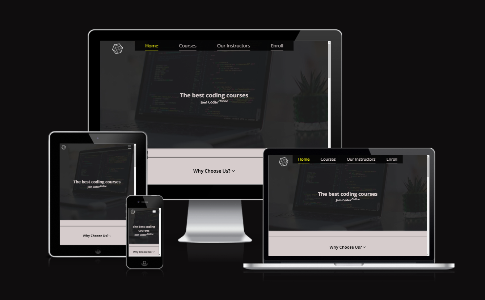

## Planning & Development
- __Target audience__
  - People who are beginning to study programming from scratch.
  - Individuals looking to deepen their knowledge.
  - Experienced developers who want to change their programming language.

- __Site Objectives__
  - The website should be convenient to navigate.
  - To higlight advantages of the school.
  - To offer statements from experienced instructors that demonstrate their expertise and passion for programming
  - To provide users with the ability to enroll to a course.

- __User story__
  - User-Friendly Navigation: As a user, I expect the website to offer intuitive navigation, enabling me to move around the site effortlessly.
  - Instructor Information: As a user, I anticipate finding comprehensive details about the school's instructors, allowing me to learn more about their expertise and background.
  - Course Information: As a user, I hope to easily access information about the variety of courses the school offers, enabling me to make informed decisions about my learning path.
  - Enrollment Process: As a user, I want a straightforward process to enroll in the desired course, ensuring a seamless experience without complications.
  - School's Advantages: As a user, I look forward to discovering the school's distinctive advantages, enabling me to understand the benefits of choosing this institution for my education.

- __Wireframes__
  - The website will be responsive, encompassing both mobile and desktop versions. The navigation menu will be positioned at the top of the page and transforms into a burger menu for mobile devices.\

  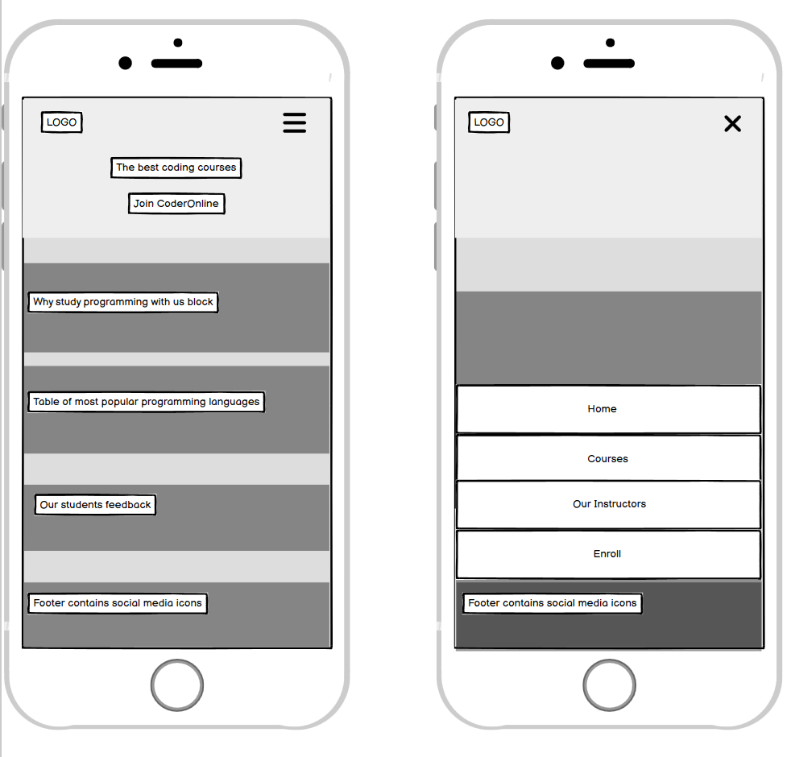

  - The home page will showcase the benefits of studying at the school, present a table of the most popular programming languages, and feature positive student feedback.

  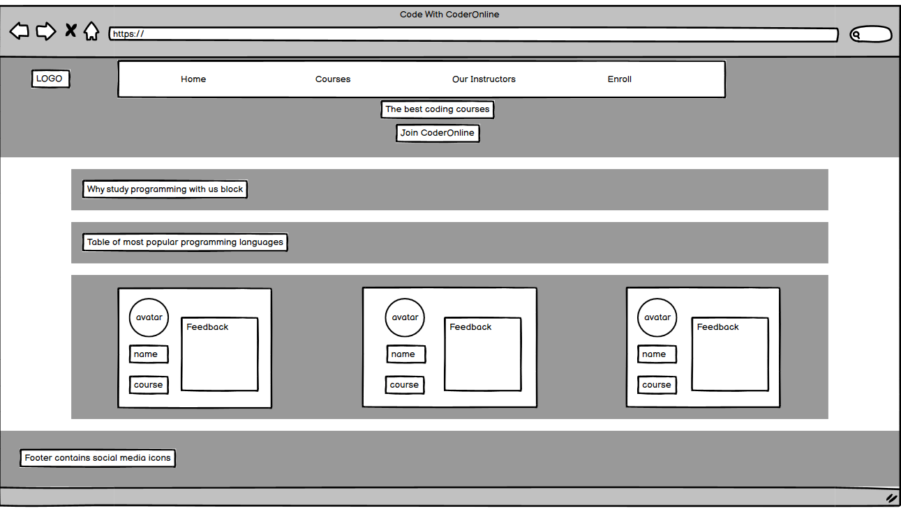

  - The courses page will display all the courses taught at the school, along with detailed descriptions for each course.

  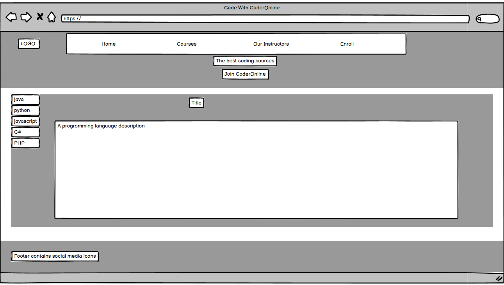

  - The instructors page provides information about the school's instructors and their professional experience.

  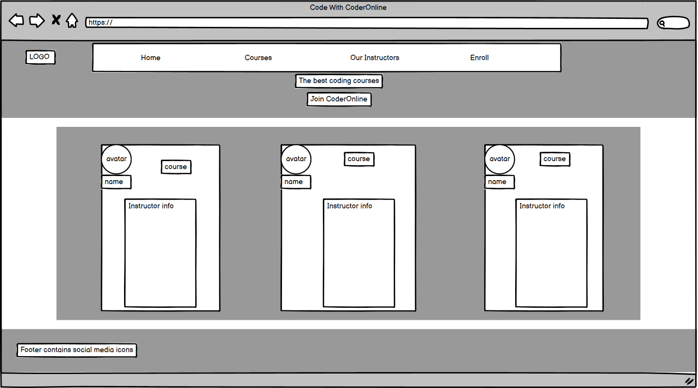

  - The enroll page offers the opportunity to fill out and submit a form to express interest in studying at the school.
  
  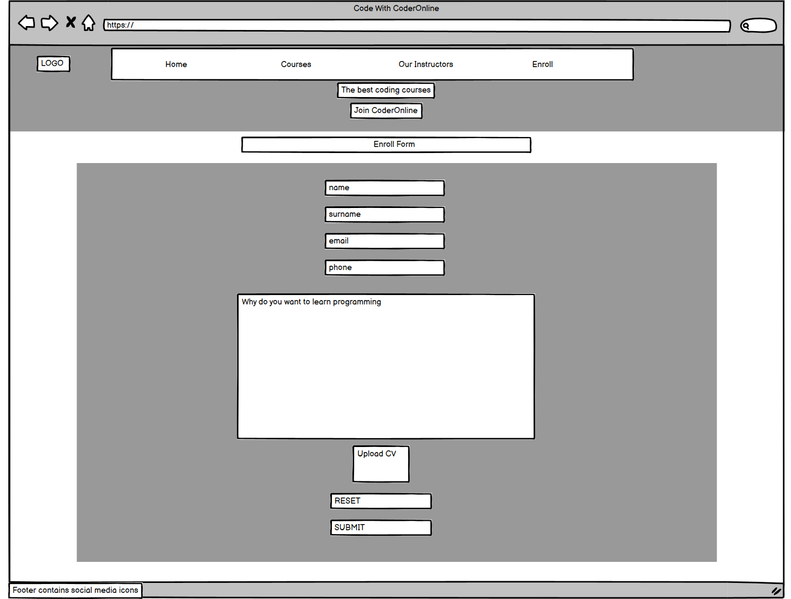

- __Fonts__
- In the initial stages of project planning, the core aim was to enhance the user experience and make it thoroughly enjoyable. To accomplish this, a deliberate decision was made to integrate two fonts that not only facilitate effortless reading but also radiate a visually pleasing aesthetic.

  - Open Sans
  - Raleway

- __Colors__
- The color palette was intentionally selected to exude simplicity and comfort for the viewer. The main color is a light gray, while the highlight color is yellow. The dark color is black, and the light color is white.

  - main color: #d6cccc
  - highlight color: #eded10
  - dark color: #000000;
  - light color: #ffffff;

- __Technologies__
  - HTML
  - CSS

## Features

### Navigation Menu

- The Navigation Menu comprises four pages: Home, Courses, Our Instructors, and Enroll.
- It's designed to be responsive, appearing differently on mobile devices.
- Depending on the selected page, the corresponding menu item is highlighted.

- __Mobile__
  - A burger menu is displayed on screens with a width of 1200px or less.
  - When the burger icon is clicked, an overlay, a cancel icon, and a navigation menu appear, while the burger icon itself disappears.
  - Both the burger and cancel icons are positioned at the top right corner of the screen, maintaining their location even when the screen is scrolled.
  - When the cancel icon is clicked, the navigation menu is closed, causing the cancel icon to disappear, and in its place, the burger menu icon reappears.
  - The navigation menu is situated at the bottom of the screen.
  - The navigation menu is organized in a column layout.

- __Desktop__
  - If the screen width exceeds 1200px, the navigation menu is shown instead of the burger menu.
  - The navigation menu is aligned in a row layout and is consistently positioned at the top of the screen.
  - When a navigation item is hovered over, the text changes its color and increases in size.

### Navigation Headings

Each section with substantial content begins with an interactive heading. Clicking on this heading will cause the page to scroll to its corresponding content.

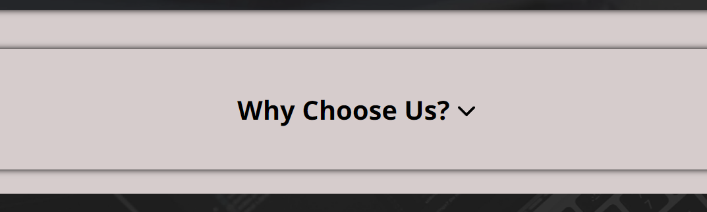 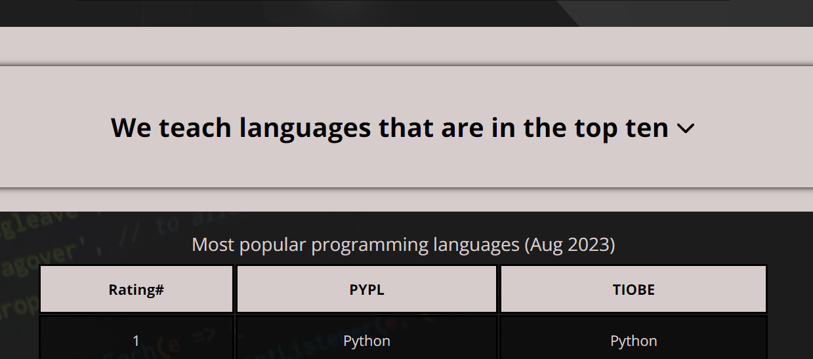

### Why Choose Us Section
- The "Why Choose Us" Section highlights the benefits of studying at the school.
- Each point within this section is interactive. Clicking on a point reveals more detailed information.
- There is also an advertisement encouraging enrollment, accompanied by a link with a black background that directs users to the Enroll page.

### Courses Page
- The "Courses Page" displays a list of courses along with their respective descriptions.
- To access the description of a course you're interested in, simply click on the respective course.
- The course whose description is currently open is highlighted.

### Enroll Page
- On the Enroll Page, there is a form present. This form cannot be submitted unless all required fields are completely filled out.
- Two buttons are provided: one for submitting the form and the other for resetting the form to its initial state.
- The required fields that must be completed include: Name, Surname, Email, Phone, Your reasons for learning programming, and Upload CV.
- For the "Upload CV", a file upload is necessary to submit the CV.
- Once submitted, the "Submit Page" opens, displaying a message confirming the successful submission of the form.

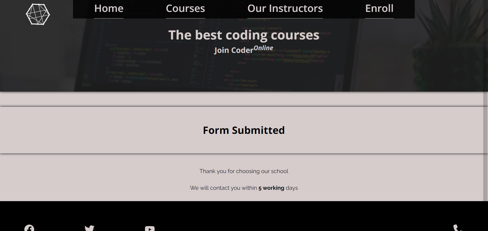

### 404 Page

If you enter an incorrect URL, the 404 Page will appear.

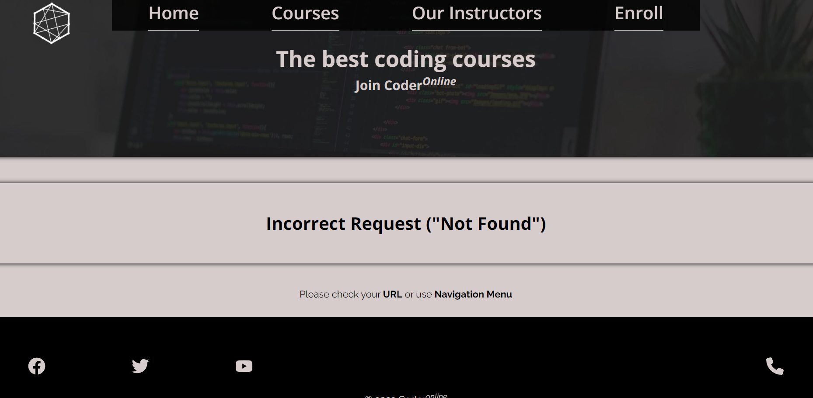

### Footer
- In the footer, there are social icons (Facebook, Twitter, YouTube) as well as a phone icon.
- When a social icon is clicked, it opens in a new tab.
- Clicking on the phone icon triggers the application to initiate a call.

### Responsiveness
The website's appearance varies based on the screen size, leading to adjustments in font sizes, layout, and background images resolution to accommodate different devices

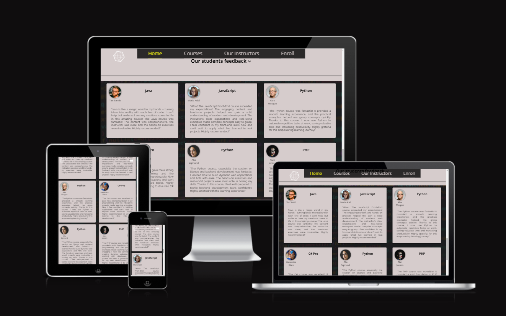

## Content

### Home Page
- The 'Why Choose Us' section showcases a list of advantages associated with studying at the school, accompanied by descriptions that elaborate on each of these advantages.
- Table of Top Programming Languages According to PYPL and Stack Overflow for 2022.
- Cards containing students' feedback.

### Courses Page
- Courses' names
- Course Description

### Instructors Page
- Cards containing information about the school's instructors.

### Enroll Page
- Enrollment form.

### Submit Page
- Submit Page confirms successful form submission.

### 404 Page
- The 404 Page informs that an incorrect URL has been entered and provides a recommendation to verify the URL or use the Navigation menu.

## Testing 

### Validator Testing 
- __W3C HTML Validator__
  - All HTML files have been validated using the W3C HTML Validator, with no errors or warnings found.
  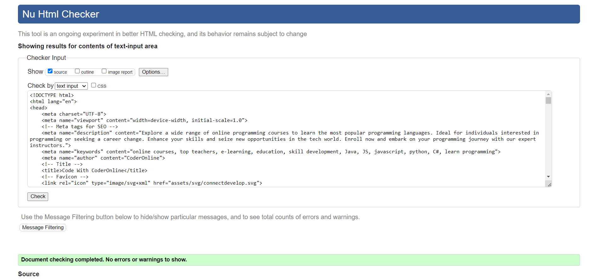

- __W3C CSS Validator (Jigsaw)__
  - The CSS code has been validated using the W3C CSS Validator (Jigsaw), and no errors were found.
  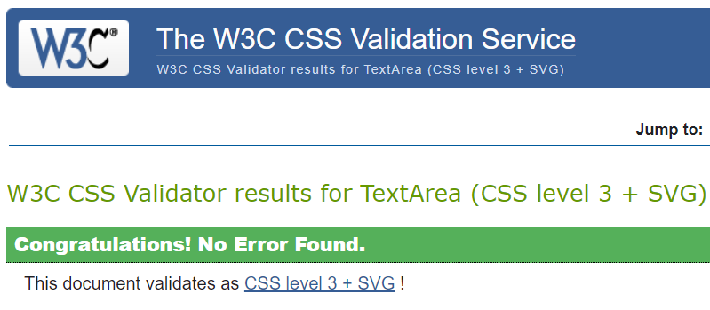

  - The only warning that was found pertains to the imported Google fonts, which are an external link and therefore cannot be validated.
  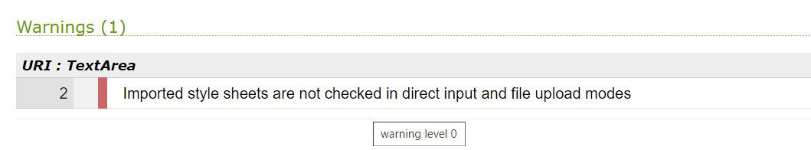

### Lighthouse

Lighthouse reports flawless scores of 100% for SEO, Best Practices, and Accessibility. The only area of concern was Performance, with scores ranging from 80 to 90 due to varying internet speeds. To address this, optimizations were made to the background and avatar images. Additionally, by using an overlay, I could significantly reduce the quality of all background images without compromising the website's visual appearance. This led to an improvement in Performance, resulting in scores ranging from 90 to 100.

- Lighthouse results for desktop
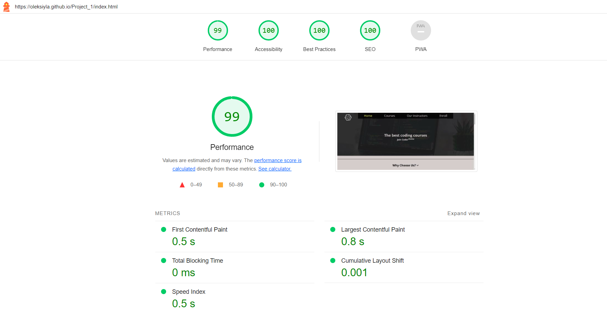

- Lighthouse results for mobile
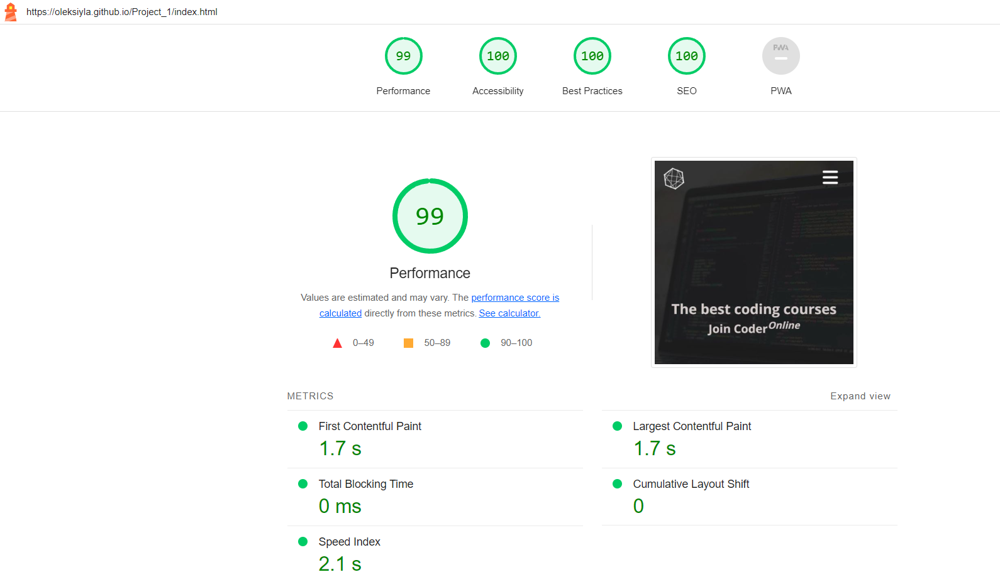
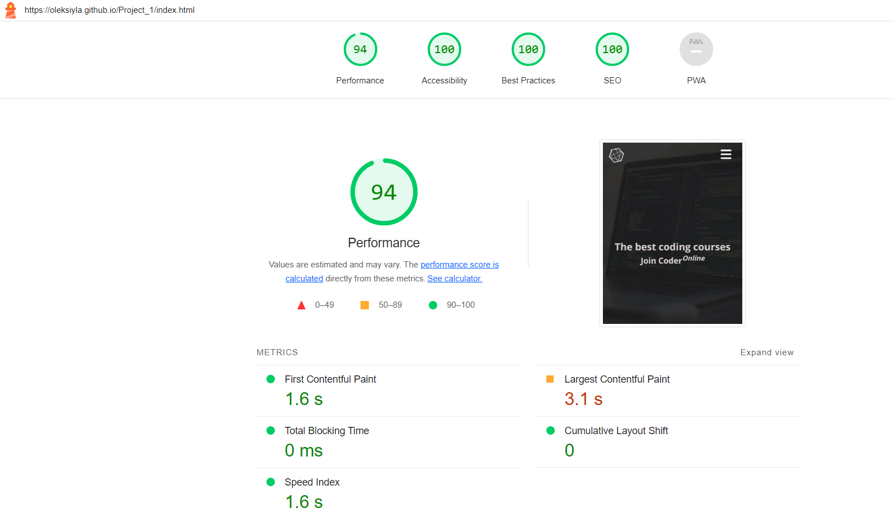

### Manual Testing
- Ensured the visibility of the burger menu on mobile devices.
- After clicking, the burger menu disappears, and in its place, a cancel icon appears.
- Clicking the burger icon reveals the navigation menu.
- Instead of a burger menu, the desktop version features a navigation bar positioned at the top.
- The navigation menu operates smoothly and efficiently.
- When clicking on an interactive section heading, the window scrolls to the main content.
- Social links in the footer open their corresponding pages in new tabs.
- Clicking the phone icon triggers a call application.
- In the 'Why Choose Us' section, the content is revealed upon clicking an item in the list of reasons.
- In the 'Why Choose Us' section, clicking on the 'Enroll' anchor tag directs you to the Enroll page.
- In the 'Our Students' Feedback' section, the layout of student comment cards varies based on the screen size.
- On the courses page, the course description changes dynamically based on the selected course, which is highlighted.
- On the 'Our Instructors' page, the layout of instructor info cards adapts to different screen sizes.
- On the Enroll page, every input field is mandatory, and the form cannot be submitted if any field has been left blank.
- The reset button restores the form to its initial state.
- After submitting the form, the browser redirects to a new page that informs the user about the successful submission.
- When an incorrect URL is entered, the browser redirects to a page that informs the user about the error and provides guidance to either check the URL or use the navigation menu.

### Unfixed Bugs
- Currently, there is no visible indication when a file is uploaded through the file input in the Enroll form. This problem can be resolved by employing JavaScript. Since I am exclusively using HTML and CSS for this project, I decided to leave this issue unresolved for now.

- The textarea on the Enroll page doesn't have any limitations on the amount of text you can input. This can be resolved with JavaScript as well.

### Fixed Bugs
-__Logo image covers an interactive element__

- While on the course page, you might face difficulty clicking the course button if it's obstructed by the logo image.

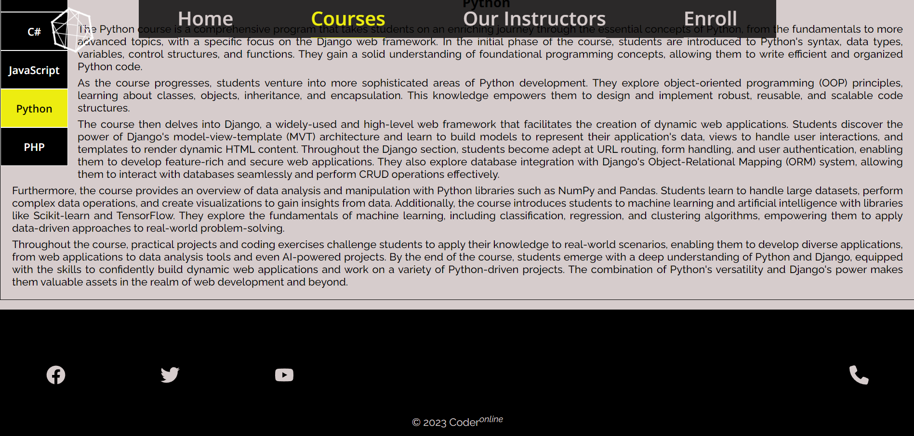

- To address this issue, I initially attempted to resolve it by adjusting the z-index. However, this approach proved insufficient due to complications arising from the nested positioning of the logo within another element. Altering the z-index of that element risked disrupting the overall appearance, notably with the navigation menu. As an alternative, I opted to reposition the logo within the HTML and fine-tuned the z-index accordingly.

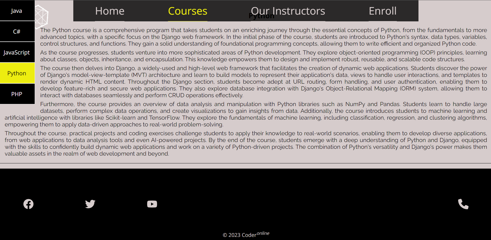

### Test against userstories
  - User-Friendly Navigation: As a user, I expect the website to offer intuitive navigation, enabling me to move around the site effortlessly.
    - <pre>
      The website's navigation menu is thoughtfully designed to prioritize simplicity and 
      user-friendliness. Positioned at the top of the screen, it remains consistently visible 
      for seamless accessibility. On mobile devices, the menu employs a column layout, while 
      on desktop devices, it adopts a row layout. This responsiveness is further emphasized 
      when the screen width is less than 1200px, which triggers the display of a burger menu icon.

      Upon clicking the burger icon, a series of changes takes place: an overlay emerges, 
      accompanied by a cancel icon, and the navigation menu becomes visible. Simultaneously, the 
      burger icon vanishes. Both the burger and cancel icons remain fixed at the top right corner 
      of the screen, retaining their position even as users scroll. Selecting the cancel icon closes
      the navigation menu, causing the cancel icon itself to disappear, and the burger menu icon to
      be reinstated in its place.

      The navigation menu's placement at the bottom of the screen and its organization in a column
      layout suggest that it considers multiple layout options for different scenarios. This level
      of attention to responsive design and user interaction exemplifies a comprehensive approach
      to accommodating diverse user experiences across various devices.
    </pre>
  - Instructor Information: As a user, I anticipate finding comprehensive details about the school's instructors, allowing me to learn more about their expertise and background.
    - <pre>
      The "Our Instructors" page features cards that contain information about the school's
      instructors. Each card includes a photo of the instructor, their name, and a comprehensive
      description of their experience.
    </pre>
  - Course Information: As a user, I hope to easily access information about the variety of courses the school offers, enabling me to make informed decisions about my learning path.
    - <pre>
      The "Courses" page showcases cards with details about the offered courses.
      Each card presents the course's name along with a description.
    </pre>
  - Enrollment Process: As a user, I want a straightforward process to enroll in the desired course, ensuring a seamless experience without complications.
    - <pre>
      The "Enroll" page features a form that needs to be filled out for course enrollment.
      Required fields include Name, Surname, Email, Phone, Your reasons for learning programming,
      and Upload CV. Uploading a file is necessary for the "Upload CV" section. After submission,
      the "Submit Page" opens, confirming the successful form submission.
    </pre>
  - School's Advantages: As a user, I look forward to discovering the school's distinctive advantages, enabling me to understand the benefits of choosing this institution for my education.
    - <pre>
      The "Why Choose Us" section showcases the advantages of studying at the school.
      Each point in this section is interactive; clicking on a point reveals more detailed information.
    <pre>
  

## Deployment
- __The site has been deployed to GitHub Pages. The deployment process involves the following steps:__
    - Navigate to the Settings tab within this project's repository.
    - Select 'Pages' from the left-hand menu.
    - From the 'Source' section drop-down menu, choose the main branch.
    - After saving the main branch a link to the live project will be provided.

The link to the live project - https://oleksiyla.github.io/Project_1/

## Credits

### Content
- PYPL index provides ratings for the most popular programming languages (Aug 2023): https://pypl.github.io/PYPL.html
- TIOBE index provides ratings for the most popular programming languages (Aug 2023): https://www.tiobe.com/tiobe-index/
- The text content was composed with the assistance of ChatGPT: https://chat.openai.com
- The Raleway and Open Sans fonts were obtained from Google Fonts: https://fonts.google.com

### Media
- Background images and avatar images were sourced from Unsplash: https://unsplash.com
- All SVG icons, including the favicon, were sourced from FontAwesome: https://fontawesome.com

### Thanks
- Grateful to my mentor, Richard Wells, for his valuable advice and support.